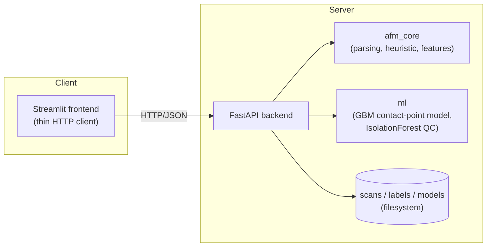

# AFM Explorer

A full-stack platform for analyzing Atomic Force Microscopy (AFM) force-distance
data: parses raw instrument exports, estimates the contact-point stiffness of
each force curve (via a classical heuristic *or* a trained ML model), and
serves interactive height/stiffness maps and a curve explorer through a
REST API + web frontend. Containerized with Docker Compose and deployable to
a free-tier cloud VM.

## Origin: a university programming assignment

This project began as the three-part programming assignment for **Algorithmic
Bioinformatics** (Programming with Python for Bioinformatics), taught by
Johanna Schmitz and Sven Rahmann at Universität des Saarlandes. The
assignment's own framing of the problem:

> One examines a flat surface with "blobs" of some unknown material on it. A
> thin needle is pushed down onto the surface until it hits the surface or
> the blob. The surface or the material then pushes back, which results in a
> measurable force. This is repeated on many locations (i, j) on the surface.

That's atomic force microscopy force-spectroscopy, and the assignment was
structured in three parts, each building on the last:

- **Part I** : given only an incomplete stub
  ([`legacy_scripts/plotafm-partial.py`](legacy_scripts/plotafm-partial.py),
  two `TODO`s and no working code), parse the raw AFM text export's
  block/metadata format and produce a labeled, legible plot per force curve.
  The finished submission is [`legacy_scripts/plotafm.py`](legacy_scripts/plotafm.py).
- **Part II** : estimate the slope of the linear "contact"
  region on push (series-0) curves, overlay the fitted line on the plot, and
  print `series i j slope` per spectrum in a format strict enough for
  automated grading. The finished submission is
  [`legacy_scripts/estimate_afm.py`](legacy_scripts/estimate_afm.py).
- **Part III**: scale to the *full* 128×128-pixel dataset-
  32,768 force curves total (two series × 16,384 pixels) using two files
  the course staff preprocessed and provided directly: `afm.heights.npy`
  (real, independently measured topography — a sample copy is included at
  [`data/samples/afm.heights.npy`](data/samples/afm.heights.npy)) and
  `afm.data.pickled`. The task was to build a Streamlit app with a height
  heatmap, a slope heatmap, and sidebar-driven series/i/j selection down to
  an individual curve plot, plus an explicitly optional bonus to
  make the heatmaps themselves clickable via `streamlit_plotly_events` and
  `st.session_state`. The two finished submissions/iterations are
  [`legacy_scripts/afm.py`](legacy_scripts/afm.py) and
  [`legacy_scripts/app2.py`](legacy_scripts/app2.py),two independent passes
  at the same brief, which is why they're near-duplicates with two different
  slope-estimation heuristics rather than one shared implementation.

All five original files live under [`legacy_scripts/`](legacy_scripts)
unmodified, for reference.

## From coursework to a full stack project

The assignment was scoped and graded per-part, so nothing in it demanded a
shared library, tests, or reconciling the fact that Parts II and III each
independently reinvented "find the contact point", it left three
inconsistent heuristics for the same measurement and zero shared code once
all three parts existed side by side. Turning that into AFM Explorer meant:
consolidating the parsing/heuristic logic that had been copy-pasted and
subtly drifting across submissions into one tested library
([`packages/afm_core`](packages/afm_core)); replacing the ad-hoc
heuristic-only approach with an actual supervised ML pipeline, benchmarked
against it rather than assumed to be better
([`packages/ml`](packages/ml)); rebuilding the single Streamlit script as a
proper client/server split (FastAPI backend + thin Streamlit frontend) so
the system has a real API instead of a monolith reading pickle files off
disk; and adding a test suite, Docker/Compose, CI/CD, and a cloud deployment
path. Scroll down to "What this demonstrates" near the end of this README for the
short version, and the rest of this document for the long version.

## Architecture



In production, nginx sits in front of both containers (`/` → frontend,
`/api` → backend) — see [`docker/nginx/nginx.conf`](docker/nginx/nginx.conf)
and [`docker-compose.prod.yml`](docker-compose.prod.yml).

## The AI feature

The core measurement this project makes is where does the AFM tip's
force-distance curve transition from noise to the linear "contact" region,
and what's the slope (stiffness) there, which was previously three different
hand-tuned heuristics. This project adds a **supervised ML alternative**:

1. **Label**: click the true contact point on a real curve in the frontend's
   Label page (`POST /api/labels`).
2. **Expand**: each label is expanded into every sliding window over that
   curve (window=50, step=10, matching the classical heuristic), labeled
   positive/negative by whether it contains the true contact point, turning
   a handful of human labels into thousands of training rows
   ([`packages/ml/ml/dataset.py`](packages/ml/ml/dataset.py)).
3. **Train**: a `HistGradientBoostingClassifier` over engineered window
   features (slope, R², curvature, local variance, position, force
   stats, [`packages/afm_core/afm_core/features.py`](packages/afm_core/afm_core/features.py))
   is trained via `POST /api/train`, plus an unsupervised `IsolationForest`
   over whole-curve features for zero-label quality control.
4. **Evaluate**: [`packages/ml/ml/evaluate.py`](packages/ml/ml/evaluate.py)
   benchmarks the ML model against the classical heuristic on held-out
   labeled curves (curve-level split to ensure no leakage), reporting mean
   contact-index error for both.

Gradient boosting over engineered features (not a neural net) was a
deliberate choice: the realistic label budget for a project like this is
tens to a couple hundred hand-labeled curves, which is enough to train a
tree ensemble well but would overfit a deep model badly.

## Repo layout

```
packages/afm_core/   shared parsing + classical heuristic + feature engineering
packages/ml/         ML pipeline: dataset building, training, inference, evaluation
packages/mcp_server/ MCP server exposing the REST API as tools for an LLM agent
backend/             FastAPI app (REST API, storage, orchestration)
frontend/            Streamlit app (thin HTTP client)
docker/nginx/        reverse proxy config for prod
deploy/              EC2 bootstrap script
data/samples/        sample.txt fixture (+ afm.heights.npy reference data) used by the test suite
legacy_scripts/      the five original course files, kept for reference (see "Origin" above)
```

## Running locally 

```bash
python3 -m venv .venv && source .venv/bin/activate
pip install -e packages/afm_core -e packages/ml
pip install -r backend/requirements-dev.txt
pip install -r frontend/requirements.txt

# terminal 1
cd backend && uvicorn app.main:app --reload

# terminal 2
export BACKEND_URL=http://localhost:8000
cd frontend/streamlit_app && streamlit run Home.py
```

Then open http://localhost:8501, upload `data/samples/sample.txt`, and
explore. `data/samples/sample.txt` is a small demo scan (12 curves); label a
few curves' contact points on the Label page and train a model to see the
full pipeline.

## Running with Docker

```bash
docker compose up --build            # dev: hot-reload, ports 8000 + 8501 exposed directly
# or, production-shaped (nginx in front, no dev mounts):
docker compose -f docker-compose.yml -f docker-compose.prod.yml up -d --build
```

## Testing

```bash
pytest packages/afm_core/tests   # parser + heuristic, using data/samples/sample.txt
pytest packages/ml/tests         # ML pipeline, using synthetic labeled curves
pytest backend/tests             # full API, via FastAPI TestClient
pytest packages/mcp_server/tests # MCP tools, against the real backend in-process
ruff check packages backend      # lint
```

Running these five package suites together from the repo root (rather than
each on its own, which is how CI invokes them) relies on the
`asyncio_mode = "auto"` setting mirrored into the root
[`pyproject.toml`](pyproject.toml). Why: pytest
resolves a single config file per session by walking up from the common
ancestor of the paths passed on the command line, so a plain per-package
`pyproject.toml` setting can be silently skipped once multiple packages'
test paths are given together.

`.github/workflows/ci.yml` runs all of the above (plus a Docker build check)
on every push/PR.

## API overview

Interactive docs are auto-generated at `/docs` when the backend is running
(FastAPI/Swagger). Key endpoints:

| Endpoint | Purpose |
|---|---|
| `POST /api/scans` | upload + parse a raw AFM `.txt` export |
| `GET /api/scans/{id}/heightmap` / `/stiffnessmap` | per-pixel maps (`method=heuristic\|ml`) |
| `GET /api/scans/{id}/curves/{s}/{i}/{j}/estimate` | contact-point fit for one curve |
| `POST /api/labels` | save a human-labeled contact point |
| `POST /api/train` → `GET /api/train/{job_id}` | train the ML model, poll status |
| `GET /api/models/active` | active model version + metrics |

Write endpoints (`POST /api/scans`, `/api/labels`, `/api/train`) support
optional API-key auth: unset `AFM_API_KEY` (the default) and they're open,
matching this project's original demo behavior; set it and every write
request must carry a matching `X-API-Key` header, or the backend returns
401. This is what makes it safe to hand the MCP server below write access
against a non-trusted-network deployment.

## MCP server: an intelligent assistant over this API

`packages/mcp_server/` wraps the REST API above as
[Model Context Protocol](https://modelcontextprotocol.io) tools, so an LLM
client can drive the whole workflow conversationally instead of you
clicking through Streamlit, "which pixel in this scan is stiffest?", "flag
the noisiest curves in this batch for me to review", "train a model and
tell me whether it beat the heuristic." It's built on the
[`fastmcp`](https://github.com/jlowin/fastmcp) package and talks to the backend over plain HTTP via `httpx`,
so it works against a local dev server or a deployed one identically.

Read-only tools are always registered: `list_scans`, `get_scan`,
`get_height_map`, `get_stiffness_map`, `get_curve`,
`get_contact_point_estimate`, `list_labels`, `get_active_model`,
`get_training_status`. Heightmap/stiffnessmap responses include a compact
`summary` (min/max + location, mean, missing-value count) alongside the
full grid, so an agent can answer "where's the stiffest point" without
having to reason over a 128×128 array itself. Three write tools —
`submit_label`, `upload_scan`, `train_model` — are registered too, unless
`AFM_MCP_READONLY=true` is set, in which case the server exposes read-only
tools only (useful when pointing an agent at a shared/public deployment).

To run it locally and point Claude Desktop at it:

```bash
pip install -e packages/mcp_server -e "packages/mcp_server[dev]"
```

```json
// claude_desktop_config.json
{
  "mcpServers": {
    "afm-explorer": {
      "command": "afm-mcp-server",
      "env": {
        "BACKEND_URL": "http://localhost:8000",
        "AFM_API_KEY": "",
        "AFM_MCP_READONLY": "false"
      }
    }
  }
}
```

`BACKEND_URL` can point at a deployed instance instead of localhost;
`AFM_API_KEY` should then match whatever the backend was started with (see
above), and `AFM_MCP_READONLY=true` is worth setting for anything other
than your own trusted deployment. The server speaks stdio by default (what
Claude Desktop expects); set `MCP_TRANSPORT=http` (plus optionally
`MCP_HTTP_HOST`/`MCP_HTTP_PORT`) to run it as an HTTP server instead, for
non-stdio clients.

## Known limitations / honest scope notes

- **Height map is currently an approximation, even though real height data
  exists.** `ScanCache.height_map()` approximates topography as the
  distance at each pixel's estimated contact point — documented in
  [`afm_core/preprocessing.py`](packages/afm_core/afm_core/preprocessing.py).
  This was a reasonable default given only the raw `.txt` export, but it's
  not actually necessary: the course-provided `afm.heights.npy` (a sample
  copy is in [`data/samples/`](data/samples)) contains real, independently
  measured topography for the full 128×128 grid. The backend doesn't ingest
  it yet, wiring up an optional `.npy` upload alongside the `.txt` scan and
  preferring real height data when it's available is a well-scoped, mostly
  additive next step.
- **`afm.data.pickled`** (the full 32,768-curve dataset the course provided
  for Part III) isn't part of this repo — it's a large binary file, and
  `packages/afm_core/afm_core/preprocessing.py` intentionally never
  unpickles client-supplied data anyway. 
  Real end-to-end testing at full scale means uploading the *raw*
  `.txt` export for the full dataset through the API, not the pickle.
- **Storage is filesystem-based**, not a database, appropriate for a
  single-instance demo deployment; swapping in Postgres/S3 would be the
  natural next step for a multi-instance production version.
- **Training runs in-process via FastAPI `BackgroundTasks`**, not a task
  queue — reasonable because training takes seconds on this data/model
  scale; a real task queue (Celery/RQ) would be warranted at a larger scale.


