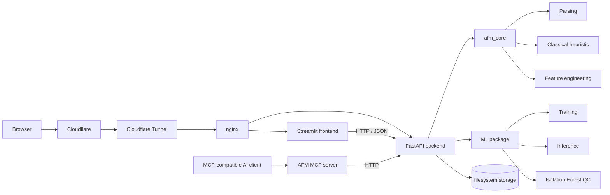
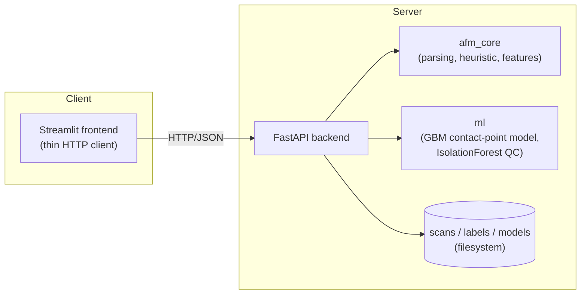

# AFM Explorer

[](https://github.com/KashishMendiratta/afm-explorer/actions/workflows/ci.yml)

**Live demo:** https://afm.kashishmendiratta.com

AFM Explorer is a full-stack platform for analyzing Atomic Force Microscopy (AFM) force-distance data. It started as a university programming assignment and was rebuilt into a tested, containerized, cloud-deployed application with a REST API, interactive visualizations, machine-learning-based contact-point estimation, CI/CD, and an MCP interface for AI-assisted analysis.

## What does AFM Explorer do?

Atomic Force Microscopy uses a very small probe to press against many points on a surface. Each interaction produces a force-distance curve that describes how the material responds. AFM Explorer turns those raw measurements into interactive maps and plots, estimates where the probe first makes contact with the surface, and uses the fitted response to compare stiffness across a scan.

For a non-technical user, the workflow is simple: upload an AFM scan, explore the generated maps, click into individual measurement locations, inspect their force curves, and compare classical and machine-learning estimates. For developers and researchers, the same functionality is exposed through a REST API and an MCP tool layer.

## Full-stack ML system

The original project came from the **Algorithmic Bioinformatics / Programming with Python for Bioinformatics** course at Universität des Saarlandes.

The coursework was developed in three stages:

1. Parse the block-based AFM text export and plot individual force-distance curves.
2. Estimate the approximately linear contact region and report its slope.
3. Build a Streamlit interface for exploring height and stiffness maps and selecting individual curves.

The original submissions are preserved under [`legacy_scripts/`](legacy_scripts) for provenance and comparison.

The coursework version consisted of standalone scripts with duplicated parsing logic and several different approaches to finding the contact region. AFM Explorer refactors that work into reusable packages and extends it with:

- a shared and tested AFM analysis library
- a FastAPI REST backend
- a thin Streamlit frontend
- supervised ML contact-point estimation
- unsupervised curve quality control
- model evaluation against a classical heuristic baseline
- Docker and Docker Compose
- nginx reverse proxying
- AWS EC2 deployment
- HTTPS through Cloudflare Tunnel
- GitHub Actions CI/CD
- an MCP server exposing AFM functionality as AI-callable tools

## Architecture



### Main components

- **`packages/afm_core`** — parsing, schemas, preprocessing, feature engineering, and the classical contact-region heuristic.
- **`packages/ml`** — training-data generation, supervised contact-point modeling, inference, evaluation, and unsupervised quality control.
- **`backend`** — FastAPI application exposing scan, curve, map, labeling, training, model, and health endpoints.
- **`frontend`** — Streamlit application that communicates with the backend over HTTP rather than reading data directly from disk.
- **`packages/mcp_server`** — Model Context Protocol server exposing the REST API as tools for an AI client.
- **`docker/nginx`** — production reverse-proxy configuration.
- **`.github/workflows`** — continuous integration and deployment workflows.

## Core AFM analysis

The central analysis task is to identify where a force-distance curve transitions into the approximately linear contact region.

The original coursework implemented this using hand-written heuristics. AFM Explorer consolidates that logic into a reusable baseline and represents the result consistently so that the same downstream API and UI can work with either the classical or ML estimator.

For each scan, the application can provide:

- parsed force-distance curves
- per-location contact-region estimates
- stiffness-related slope estimates
- height-map approximation
- stiffness maps
- individual curve inspection

## Machine-learning feature

AFM Explorer adds a supervised alternative to the classical contact-region heuristic.

### 1. Human labeling

A user selects the contact point of a real force curve in the frontend. The stored label identifies:

```text
scan_id
series
i
j
contact_index
```

### 2. Training-data expansion

Each labeled curve is expanded into multiple sliding-window training examples. Shared feature engineering computes quantities such as:

- slope
- R²
- local variance
- curvature
- force statistics
- normalized position along the curve

Windows containing the human-selected contact point become positive examples; the remaining windows become negative examples.

This allows a relatively small number of labeled curves to produce a larger window-level training set.

### 3. Supervised contact-point model

The current supervised estimator uses:

`HistGradientBoostingClassifier`

A tree-based model was chosen deliberately because the realistic label budget is relatively small. Training and evaluation are split at the **curve level**, rather than randomly at the window level, so windows from the same curve cannot leak into both training and evaluation sets.

### 4. Unsupervised quality control

An `IsolationForest` operates on whole-curve features to provide anomaly and quality-control signals without requiring labels.

### 5. Evaluation

The ML estimator is evaluated against the classical heuristic on held-out labeled curves. The key question is not simply whether a model can be trained, but whether it reduces contact-index error relative to the original heuristic.

## AI-assisted analysis with MCP

AFM Explorer includes an MCP server under [`packages/mcp_server/`](packages/mcp_server).

The Model Context Protocol layer converts the REST API into tools that an MCP-compatible AI client can call. This lets an AI assistant inspect AFM data through controlled application interfaces rather than by reading internal files or manipulating Python objects directly.

Example questions and workflows include:

- "Which location in this scan has the highest estimated stiffness?"
- "Show me the curve at that location."
- "Which curves look anomalous and may need review?"
- "How many human labels are available?"
- "What model is currently active?"
- "Did the trained estimator outperform the classical heuristic?"

### Read tools

The MCP server exposes read-oriented tools including:

- `list_scans`
- `get_scan`
- `get_height_map`
- `get_stiffness_map`
- `get_curve`
- `get_contact_point_estimate`
- `list_labels`
- `get_active_model`
- `get_training_status`

Map responses include compact summaries such as minimum, maximum, mean, missing-value count, and extrema locations so an AI client does not need to reason token-by-token over an entire grid.

### Write tools

The MCP layer can also expose:

- `upload_scan`
- `submit_label`
- `train_model`

Write tools can be removed entirely from the exposed MCP tool set by setting:

```bash
AFM_MCP_READONLY=true
```

This is the preferred mode for read-only or shared AI access.

The MCP integration provides the tool layer for AI-assisted analysis. A dedicated autonomous multi-step agent that independently plans and chains several AFM operations is intentionally left as future work.

## Repository layout

```text
packages/
├── afm_core/       Shared parsing, schemas, heuristics and feature engineering
├── ml/             Dataset generation, training, inference and evaluation
└── mcp_server/     MCP tools wrapping the REST API

backend/            FastAPI application, storage and orchestration
frontend/           Streamlit frontend
docker/nginx/       Production reverse-proxy configuration
deploy/             Deployment/bootstrap helpers
data/samples/       Small AFM sample data used by tests and demos
legacy_scripts/     Original university-assignment scripts
.github/workflows/  CI and CD workflows

README.md           Project overview
DEPLOY.md           Production deployment documentation
```

## Tech stack

| Area | Technology |
|---|---|
| Language | Python |
| Scientific computing | NumPy, SciPy |
| Machine learning | scikit-learn |
| Backend | FastAPI, Pydantic, Uvicorn |
| Frontend | Streamlit, Plotly |
| API communication | HTTP / JSON |
| AI tool interface | MCP / FastMCP |
| Containerization | Docker, Docker Compose |
| Reverse proxy | nginx |
| Cloud | AWS EC2 |
| HTTPS / public routing | Cloudflare Tunnel |
| CI/CD | GitHub Actions |
| Cloud authentication | GitHub OIDC → AWS IAM |
| Testing | pytest |
| Linting | Ruff |

## Running locally

### Prerequisites

- Python 3.11+
- Git
- Docker and Docker Compose if using the containerized setup

Clone the repository:

```bash
git clone https://github.com/KashishMendiratta/afm-explorer.git
cd afm-explorer
```

Create and activate a virtual environment:

```bash
python3 -m venv .venv
source .venv/bin/activate
python -m pip install --upgrade pip
```

Install the internal AFM and ML packages:

```bash
pip install -e packages/afm_core -e packages/ml
```

Install backend dependencies from inside `backend/` because the development requirements contain relative editable-package paths:

```bash
cd backend
pip install -r requirements-dev.txt
cd ..
```

Install frontend dependencies:

```bash
pip install -r frontend/requirements.txt
```

Install the MCP package if you want the AI/MCP interface:

```bash
pip install -e packages/mcp_server -e "packages/mcp_server[dev]"
```

### Start the backend

Terminal 1:

```bash
source .venv/bin/activate
cd backend
uvicorn app.main:app --reload
```

Backend:

`http://localhost:8000`

Interactive FastAPI / Swagger documentation:

`http://localhost:8000/docs`

### Start the frontend

Terminal 2:

```bash
source .venv/bin/activate
export BACKEND_URL=http://localhost:8000
cd frontend/streamlit_app
streamlit run Home.py
```

Open:

`http://localhost:8501`

Upload:

`data/samples/sample.txt`

to explore the demo scan.

## Running with Docker

### Development

```bash
docker compose config
docker compose up --build
```

The development override exposes the backend and frontend directly and enables development-oriented behavior such as source mounts and reload.

### Production-shaped local stack

Validate the merged configuration:

```bash
docker compose   -f docker-compose.yml   -f docker-compose.prod.yml   config
```

Run it:

```bash
docker compose   -f docker-compose.yml   -f docker-compose.prod.yml   up -d --build
```

In production, nginx is the entry point and routes `/` to Streamlit and `/api/` to FastAPI.

## Testing

Run the package suites separately:

```bash
pytest packages/afm_core/tests -q
pytest packages/ml/tests -q
pytest packages/mcp_server/tests -q
```

Backend tests:

```bash
cd backend
pytest tests -q
cd ..
```

Lint:

```bash
ruff check packages backend frontend
```

Frontend syntax check:

```bash
python -m compileall -q frontend
```

Validate production Compose:

```bash
docker compose   -f docker-compose.yml   -f docker-compose.prod.yml   config
```

## API overview

FastAPI exposes the main application functionality through a REST API.

| Endpoint | Purpose |
|---|---|
| `POST /api/scans` | Upload and parse a raw AFM text export |
| `GET /api/scans` | List scans |
| `GET /api/scans/{id}` | Read scan metadata |
| `GET /api/scans/{id}/heightmap` | Get the height map |
| `GET /api/scans/{id}/stiffnessmap` | Get the stiffness map |
| `GET /api/scans/{id}/curves/{s}/{i}/{j}` | Get one raw force curve |
| `GET /api/scans/{id}/curves/{s}/{i}/{j}/estimate` | Estimate the contact region |
| `POST /api/labels` | Save a human contact-point label |
| `POST /api/train` | Start model training |
| `GET /api/train/{job_id}` | Poll training status |
| `GET /api/models/active` | Read active model metadata and metrics |
| `GET /api/health` | Health check |

Write endpoints support optional API-key protection through `AFM_API_KEY`.

When an API key is configured, write requests must provide the matching `X-API-Key` header.

## Using the MCP server

Install the MCP package:

```bash
pip install -e packages/mcp_server -e "packages/mcp_server[dev]"
```

The installed console command is:

```bash
afm-mcp-server
```

### Example MCP client configuration

For Claude Desktop, add the following to `claude_desktop_config.json`:

```json
{
  "mcpServers": {
    "afm-explorer": {
      "command": "afm-mcp-server",
      "env": {
        "BACKEND_URL": "http://localhost:8000",
        "AFM_API_KEY": "",
        "AFM_MCP_READONLY": "false"
      }
    }
  }
}
```

The JSON block contains no comments, so it can be copied directly into a JSON configuration file.

`BACKEND_URL` can also point to the deployed application:

```text
https://afm.kashishmendiratta.com
```

For shared or untrusted access, prefer:

```text
AFM_MCP_READONLY=true
```

unless backend API-key authentication has also been configured appropriately.

The MCP server speaks stdio by default. Other supported transports can be selected through the corresponding MCP environment variables.

## Production deployment

AFM Explorer is currently deployed at:

**https://afm.kashishmendiratta.com**

The production stack uses:

- Ubuntu Server 26.04 LTS on AWS EC2
- Docker Compose
- nginx as the internal reverse proxy
- Cloudflare Tunnel for HTTPS and public routing
- no direct public exposure of the FastAPI or Streamlit ports

The application is reached through:

```text
Browser
   |
   | HTTPS
   v
Cloudflare
   |
   | outbound tunnel
   v
cloudflared on EC2
   |
   v
nginx
  /  /   Streamlit   FastAPI
```

Full setup, security, recovery, and deployment details are documented in [`DEPLOY.md`](DEPLOY.md).

## Continuous Integration and Deployment

### Continuous Integration

`.github/workflows/ci.yml` runs automatically on pushes and pull requests.

The CI pipeline performs:

1. dependency installation
2. Ruff linting
3. `afm_core` tests
4. ML tests
5. backend tests
6. MCP tests
7. frontend syntax checks
8. production Compose validation
9. Docker build checks

### Continuous Deployment

After CI succeeds on `main`, `.github/workflows/cd.yml` deploys the updated application to AWS EC2.

The deployment uses:

- GitHub OIDC rather than long-lived AWS access keys
- a least-privilege AWS IAM role
- temporary SSH access restricted to the current GitHub Actions runner IP
- a dedicated deployment SSH key
- Docker Compose rebuild/restart
- a live health check after deployment
- automatic removal of the temporary SSH rule

The deployment flow is:

```text
git push origin main
        |
        v
GitHub Actions CI
        |
        | success
        v
GitHub Actions CD
        |
        | OIDC
        v
AWS IAM
        |
        | short-lived credentials
        v
temporary runner-specific SSH rule
        |
        v
EC2
        |
        v
Docker Compose rebuild
        |
        v
health check
        |
        v
live application
```

See [`DEPLOY.md`](DEPLOY.md) for the full deployment configuration.

## Known limitations

### Height map is currently an approximation

`ScanCache.height_map()` currently approximates topography using the distance at the estimated contact point.

The original course dataset also included `afm.heights.npy`, containing independently measured topography. A sample copy exists under `data/samples/`, but the backend does not yet ingest it.

### Full preprocessed pickle is not included

The original `afm.data.pickled` contained the complete 32,768-curve preprocessed dataset and is not included in the repository.

The modern backend also intentionally avoids unpickling arbitrary client-supplied files.

### Filesystem-backed storage

Scans, labels, and models currently use filesystem storage.

This is appropriate for the current single-instance deployment. A multi-instance or multi-user production system would benefit from a database and object storage.

### In-process model training

Training currently runs through FastAPI background tasks.

This is sufficient for the current data/model scale. Larger workloads would justify a dedicated worker or task queue.

### MCP provides tools, not autonomous orchestration

The MCP integration allows an AI client to call AFM Explorer tools, but the repository does not currently contain a dedicated autonomous agent that independently plans and executes long chains of operations.

## Future work

The next extensions are intentionally focused on adding capability rather than expanding the stack for its own sake:

1. **Autonomous AI agent over the MCP tool layer**  
   Add a bounded agent orchestration layer that can plan multi-step AFM analyses, call several MCP tools, and return a grounded explanation. This should include strict turn limits, read-only-by-default behavior, and evaluation of tool-use reliability before being exposed publicly.

2. **Use real height measurements**  
   Add optional ingestion of `afm.heights.npy` and prefer independently measured topography when available, while preserving the current contact-position approximation as a fallback.

3. **Larger real labeling and ML evaluation cycle**  
   Label a substantially larger set of real curves and report robust heuristic-vs-ML contact-point error on held-out curves.

# AFM Explorer

A full-stack platform for analyzing Atomic Force Microscopy (AFM) force-distance
data: parses raw instrument exports, estimates the contact-point stiffness of
each force curve (via a classical heuristic *or* a trained ML model), and
serves interactive height/stiffness maps and a curve explorer through a
REST API + web frontend. Containerized with Docker Compose and deployable to
a free-tier cloud VM.

## Origin: a university programming assignment

This project began as the three-part programming assignment for **Algorithmic
Bioinformatics** (Programming with Python for Bioinformatics), taught by
Johanna Schmitz and Sven Rahmann at Universität des Saarlandes. The
assignment's own framing of the problem:

> One examines a flat surface with "blobs" of some unknown material on it. A
> thin needle is pushed down onto the surface until it hits the surface or
> the blob. The surface or the material then pushes back, which results in a
> measurable force. This is repeated on many locations (i, j) on the surface.

That's atomic force microscopy force-spectroscopy, and the assignment was
structured in three parts, each building on the last:

- **Part I** : given only an incomplete stub
  ([`legacy_scripts/plotafm-partial.py`](legacy_scripts/plotafm-partial.py),
  two `TODO`s and no working code), parse the raw AFM text export's
  block/metadata format and produce a labeled, legible plot per force curve.
  The finished submission is [`legacy_scripts/plotafm.py`](legacy_scripts/plotafm.py).
- **Part II** : estimate the slope of the linear "contact"
  region on push (series-0) curves, overlay the fitted line on the plot, and
  print `series i j slope` per spectrum in a format strict enough for
  automated grading. The finished submission is
  [`legacy_scripts/estimate_afm.py`](legacy_scripts/estimate_afm.py).
- **Part III**: scale to the *full* 128×128-pixel dataset-
  32,768 force curves total (two series × 16,384 pixels) using two files
  the course staff preprocessed and provided directly: `afm.heights.npy`
  (real, independently measured topography — a sample copy is included at
  [`data/samples/afm.heights.npy`](data/samples/afm.heights.npy)) and
  `afm.data.pickled`. The task was to build a Streamlit app with a height
  heatmap, a slope heatmap, and sidebar-driven series/i/j selection down to
  an individual curve plot, plus an explicitly optional bonus to
  make the heatmaps themselves clickable via `streamlit_plotly_events` and
  `st.session_state`. The two finished submissions/iterations are
  [`legacy_scripts/afm.py`](legacy_scripts/afm.py) and
  [`legacy_scripts/app2.py`](legacy_scripts/app2.py),two independent passes
  at the same brief, which is why they're near-duplicates with two different
  slope-estimation heuristics rather than one shared implementation.

All five original files live under [`legacy_scripts/`](legacy_scripts)
unmodified, for reference.

## From coursework to a full stack project

The assignment was scoped and graded per-part, so nothing in it demanded a
shared library, tests, or reconciling the fact that Parts II and III each
independently reinvented "find the contact point", it left three
inconsistent heuristics for the same measurement and zero shared code once
all three parts existed side by side. Turning that into AFM Explorer meant:
consolidating the parsing/heuristic logic that had been copy-pasted and
subtly drifting across submissions into one tested library
([`packages/afm_core`](packages/afm_core)); replacing the ad-hoc
heuristic-only approach with an actual supervised ML pipeline, benchmarked
against it rather than assumed to be better
([`packages/ml`](packages/ml)); rebuilding the single Streamlit script as a
proper client/server split (FastAPI backend + thin Streamlit frontend) so
the system has a real API instead of a monolith reading pickle files off
disk; and adding a test suite, Docker/Compose, CI/CD, and a cloud deployment
path. Scroll down to "What this demonstrates" near the end of this README for the
short version, and the rest of this document for the long version.

## Architecture



In production, nginx sits in front of both containers (`/` → frontend,
`/api` → backend) — see [`docker/nginx/nginx.conf`](docker/nginx/nginx.conf)
and [`docker-compose.prod.yml`](docker-compose.prod.yml).

## The AI feature

The core measurement this project makes is where does the AFM tip's
force-distance curve transition from noise to the linear "contact" region,
and what's the slope (stiffness) there, which was previously three different
hand-tuned heuristics. This project adds a **supervised ML alternative**:

1. **Label**: click the true contact point on a real curve in the frontend's
   Label page (`POST /api/labels`).
2. **Expand**: each label is expanded into every sliding window over that
   curve (window=50, step=10, matching the classical heuristic), labeled
   positive/negative by whether it contains the true contact point, turning
   a handful of human labels into thousands of training rows
   ([`packages/ml/ml/dataset.py`](packages/ml/ml/dataset.py)).
3. **Train**: a `HistGradientBoostingClassifier` over engineered window
   features (slope, R², curvature, local variance, position, force
   stats, [`packages/afm_core/afm_core/features.py`](packages/afm_core/afm_core/features.py))
   is trained via `POST /api/train`, plus an unsupervised `IsolationForest`
   over whole-curve features for zero-label quality control.
4. **Evaluate**: [`packages/ml/ml/evaluate.py`](packages/ml/ml/evaluate.py)
   benchmarks the ML model against the classical heuristic on held-out
   labeled curves (curve-level split to ensure no leakage), reporting mean
   contact-index error for both.

Gradient boosting over engineered features (not a neural net) was a
deliberate choice: the realistic label budget for a project like this is
tens to a couple hundred hand-labeled curves, which is enough to train a
tree ensemble well but would overfit a deep model badly.

## Repo layout

```
packages/afm_core/   shared parsing + classical heuristic + feature engineering
packages/ml/         ML pipeline: dataset building, training, inference, evaluation
packages/mcp_server/ MCP server exposing the REST API as tools for an LLM agent
backend/             FastAPI app (REST API, storage, orchestration)
frontend/            Streamlit app (thin HTTP client)
docker/nginx/        reverse proxy config for prod
deploy/              EC2 bootstrap script
data/samples/        sample.txt fixture (+ afm.heights.npy reference data) used by the test suite
legacy_scripts/      the five original course files, kept for reference (see "Origin" above)
```

## Running locally 

```bash
python3 -m venv .venv && source .venv/bin/activate
pip install -e packages/afm_core -e packages/ml
pip install -r backend/requirements-dev.txt
pip install -r frontend/requirements.txt

# terminal 1
cd backend && uvicorn app.main:app --reload

# terminal 2
export BACKEND_URL=http://localhost:8000
cd frontend/streamlit_app && streamlit run Home.py
```

Then open http://localhost:8501, upload `data/samples/sample.txt`, and
explore. `data/samples/sample.txt` is a small demo scan (12 curves); label a
few curves' contact points on the Label page and train a model to see the
full pipeline.

## Running with Docker

```bash
docker compose up --build            # dev: hot-reload, ports 8000 + 8501 exposed directly
# or, production-shaped (nginx in front, no dev mounts):
docker compose -f docker-compose.yml -f docker-compose.prod.yml up -d --build
```

## Testing

```bash
pytest packages/afm_core/tests   # parser + heuristic, using data/samples/sample.txt
pytest packages/ml/tests         # ML pipeline, using synthetic labeled curves
pytest backend/tests             # full API, via FastAPI TestClient
pytest packages/mcp_server/tests # MCP tools, against the real backend in-process
ruff check packages backend      # lint
```

Running these five package suites together from the repo root (rather than
each on its own, which is how CI invokes them) relies on the
`asyncio_mode = "auto"` setting mirrored into the root
[`pyproject.toml`](pyproject.toml). Why: pytest
resolves a single config file per session by walking up from the common
ancestor of the paths passed on the command line, so a plain per-package
`pyproject.toml` setting can be silently skipped once multiple packages'
test paths are given together.

`.github/workflows/ci.yml` runs all of the above (plus a Docker build check)
on every push/PR.

## API overview

Interactive docs are auto-generated at `/docs` when the backend is running
(FastAPI/Swagger). Key endpoints:

| Endpoint | Purpose |
|---|---|
| `POST /api/scans` | upload + parse a raw AFM `.txt` export |
| `GET /api/scans/{id}/heightmap` / `/stiffnessmap` | per-pixel maps (`method=heuristic\|ml`) |
| `GET /api/scans/{id}/curves/{s}/{i}/{j}/estimate` | contact-point fit for one curve |
| `POST /api/labels` | save a human-labeled contact point |
| `POST /api/train` → `GET /api/train/{job_id}` | train the ML model, poll status |
| `GET /api/models/active` | active model version + metrics |

Write endpoints (`POST /api/scans`, `/api/labels`, `/api/train`) support
optional API-key auth: unset `AFM_API_KEY` (the default) and they're open,
matching this project's original demo behavior; set it and every write
request must carry a matching `X-API-Key` header, or the backend returns
401. This is what makes it safe to hand the MCP server below write access
against a non-trusted-network deployment.

## MCP server: an intelligent assistant over this API

`packages/mcp_server/` wraps the REST API above as
[Model Context Protocol](https://modelcontextprotocol.io) tools, so an LLM
client can drive the whole workflow conversationally instead of you
clicking through Streamlit, "which pixel in this scan is stiffest?", "flag
the noisiest curves in this batch for me to review", "train a model and
tell me whether it beat the heuristic." It's built on the
[`fastmcp`](https://github.com/jlowin/fastmcp) package and talks to the backend over plain HTTP via `httpx`,
so it works against a local dev server or a deployed one identically.

Read-only tools are always registered: `list_scans`, `get_scan`,
`get_height_map`, `get_stiffness_map`, `get_curve`,
`get_contact_point_estimate`, `list_labels`, `get_active_model`,
`get_training_status`. Heightmap/stiffnessmap responses include a compact
`summary` (min/max + location, mean, missing-value count) alongside the
full grid, so an agent can answer "where's the stiffest point" without
having to reason over a 128×128 array itself. Three write tools —
`submit_label`, `upload_scan`, `train_model` — are registered too, unless
`AFM_MCP_READONLY=true` is set, in which case the server exposes read-only
tools only (useful when pointing an agent at a shared/public deployment).

To run it locally and point Claude Desktop at it:

```bash
pip install -e packages/mcp_server -e "packages/mcp_server[dev]"
```

```json
// claude_desktop_config.json
{
  "mcpServers": {
    "afm-explorer": {
      "command": "afm-mcp-server",
      "env": {
        "BACKEND_URL": "http://localhost:8000",
        "AFM_API_KEY": "",
        "AFM_MCP_READONLY": "false"
      }
    }
  }
}
```

`BACKEND_URL` can point at a deployed instance instead of localhost;
`AFM_API_KEY` should then match whatever the backend was started with (see
above), and `AFM_MCP_READONLY=true` is worth setting for anything other
than your own trusted deployment. The server speaks stdio by default (what
Claude Desktop expects); set `MCP_TRANSPORT=http` (plus optionally
`MCP_HTTP_HOST`/`MCP_HTTP_PORT`) to run it as an HTTP server instead, for
non-stdio clients.

## Known limitations / honest scope notes

- **Height map is currently an approximation, even though real height data
  exists.** `ScanCache.height_map()` approximates topography as the
  distance at each pixel's estimated contact point — documented in
  [`afm_core/preprocessing.py`](packages/afm_core/afm_core/preprocessing.py).
  This was a reasonable default given only the raw `.txt` export, but it's
  not actually necessary: the course-provided `afm.heights.npy` (a sample
  copy is in [`data/samples/`](data/samples)) contains real, independently
  measured topography for the full 128×128 grid. The backend doesn't ingest
  it yet, wiring up an optional `.npy` upload alongside the `.txt` scan and
  preferring real height data when it's available is a well-scoped, mostly
  additive next step.
- **`afm.data.pickled`** (the full 32,768-curve dataset the course provided
  for Part III) isn't part of this repo — it's a large binary file, and
  `packages/afm_core/afm_core/preprocessing.py` intentionally never
  unpickles client-supplied data anyway. 
  Real end-to-end testing at full scale means uploading the *raw*
  `.txt` export for the full dataset through the API, not the pickle.
- **Storage is filesystem-based**, not a database, appropriate for a
  single-instance demo deployment; swapping in Postgres/S3 would be the
  natural next step for a multi-instance production version.
- **Training runs in-process via FastAPI `BackgroundTasks`**, not a task
  queue — reasonable because training takes seconds on this data/model
  scale; a real task queue (Celery/RQ) would be warranted at a larger scale.


