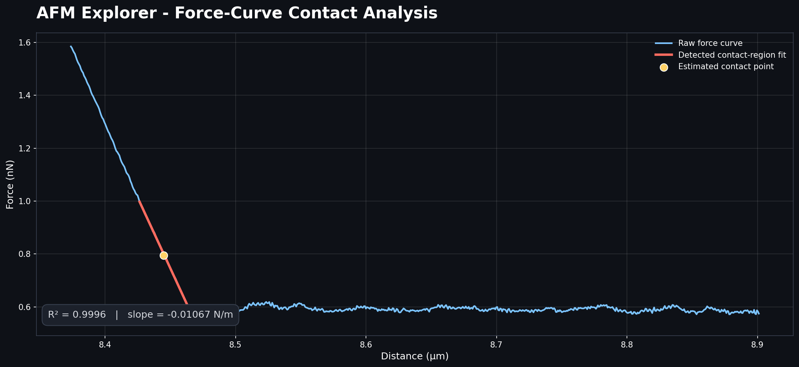
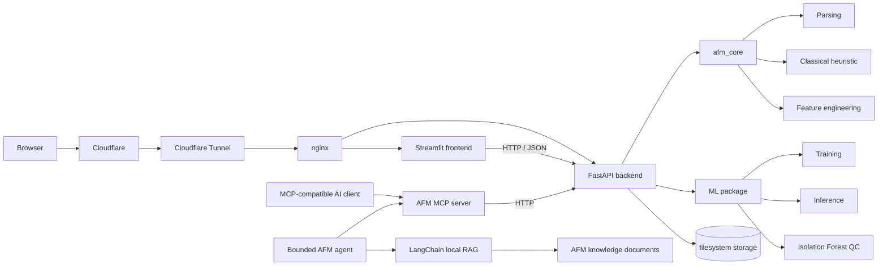

# AFM Explorer

[](https://github.com/KashishMendiratta/afm-explorer/actions/workflows/ci.yml)

**Live demo:** https://afm.kashishmendiratta.com

**Engineering evidence:** 52 automated tests · GitHub Actions CI/CD

AFM Explorer is a full-stack platform for analyzing Atomic Force Microscopy (AFM) force-distance data. It started as a university programming assignment and was rebuilt into a tested, containerized, cloud-deployed application with a REST API, interactive visualizations, machine-learning-based contact-point estimation, CI/CD, an MCP live-data interface, and a bounded autonomous agent with local retrieval-augmented generation (RAG).



*Reproducible example generated from the repository's bundled AFM scan using the classical contact-region estimator.*

## What does AFM Explorer do?

Atomic Force Microscopy uses a very small probe to press against many points on a surface. Each interaction produces a force-distance curve that describes how the material responds. AFM Explorer turns those raw measurements into interactive maps and plots, estimates where the probe first makes contact with the surface, and uses the fitted response to compare stiffness across a scan.

For a non-technical user, the workflow is simple: click **Load built-in demo**, explore the generated maps, open real measurement locations, and compare classical and machine-learning estimates. No AFM file is needed for the demo. Users can still upload their own scans, while developers and researchers can access the same functionality through REST, MCP, and the autonomous CLI agent.

## Full-stack ML system

The original project came from the **Algorithmic Bioinformatics / Programming with Python for Bioinformatics** course at Universität des Saarlandes.

The coursework was developed in three stages:

1. Parse the block-based AFM text export and plot individual force-distance curves.
2. Estimate the approximately linear contact region and report its slope.
3. Build a Streamlit interface for exploring height and stiffness maps and selecting individual curves.

The original submissions are preserved under [`legacy_scripts/`](legacy_scripts) for provenance and comparison.

The coursework version consisted of standalone scripts with duplicated parsing logic and several different approaches to finding the contact region. AFM Explorer refactors that work into reusable packages and extends it with:

- a shared and tested AFM analysis library
- a FastAPI REST backend
- a thin Streamlit frontend
- supervised ML contact-point estimation
- unsupervised curve quality control
- model evaluation against a classical heuristic baseline
- Docker and Docker Compose
- nginx reverse proxying
- AWS EC2 deployment
- HTTPS through Cloudflare Tunnel
- GitHub Actions CI/CD
- an MCP server exposing AFM functionality as AI-callable tools
- a read-only-by-default autonomous agent combining MCP data with local LangChain RAG

## Architecture



### Main components

- **`packages/afm_core`** — parsing, schemas, preprocessing, feature engineering, and the classical contact-region heuristic.
- **`packages/ml`** — training-data generation, supervised contact-point modeling, inference, evaluation, and unsupervised quality control.
- **`backend`** — FastAPI application exposing scan, curve, map, labeling, training, model, and health endpoints.
- **`frontend`** — Streamlit application that communicates with the backend over HTTP rather than reading data directly from disk.
- **`packages/mcp_server`** — Model Context Protocol server exposing the REST API as tools for an AI client.
- **`packages/rag`** — LangChain loaders, recursive chunking, deterministic local embeddings, an in-process vector store, retrieval, and retrieval evaluation.
- **`packages/agent`** — OpenAI Agents SDK runner combining MCP tools with `search_afm_knowledge`, bounded turns, CLI execution, and read-only defaults.
- **`docker/nginx`** — production reverse-proxy configuration.
- **`.github/workflows`** — continuous integration and deployment workflows.

## Core AFM analysis

The central analysis task is to identify where a force-distance curve transitions into the approximately linear contact region.

The original coursework implemented this using hand-written heuristics. AFM Explorer consolidates that logic into a reusable baseline and represents the result consistently so that the same downstream API and UI can work with either the classical or ML estimator.

For each scan, the application can provide:

- parsed force-distance curves
- per-location contact-region estimates
- stiffness-related slope estimates
- height-map approximation
- stiffness maps
- individual curve inspection

## Machine-learning feature

AFM Explorer adds a supervised alternative to the classical contact-region heuristic.

### 1. Human labeling

A user selects the contact point of a real force curve in the frontend. The stored label identifies:

```text
scan_id
series
i
j
contact_index
```

### 2. Training-data expansion

Each labeled curve is expanded into multiple sliding-window training examples. Shared feature engineering computes quantities such as:

- slope
- R²
- local variance
- curvature
- force statistics
- normalized position along the curve

Windows containing the human-selected contact point become positive examples; the remaining windows become negative examples.

This allows a relatively small number of labeled curves to produce a larger window-level training set.

### 3. Supervised contact-point model

The current supervised estimator uses:

`HistGradientBoostingClassifier`

A tree-based model was chosen deliberately because the realistic label budget is relatively small. Training and evaluation are split at the **curve level**, rather than randomly at the window level, so windows from the same curve cannot leak into both training and evaluation sets.

### 4. Unsupervised quality control

An `IsolationForest` operates on whole-curve features to provide anomaly and quality-control signals without requiring labels.

### 5. Evaluation

The ML estimator is evaluated against the classical heuristic on held-out labeled curves. The key question is not simply whether a model can be trained, but whether it reduces contact-index error relative to the original heuristic.

## Autonomous MCP + RAG agent

AFM Explorer includes a bounded autonomous agent under [`packages/agent/`](packages/agent). The OpenAI Agents SDK runs the model/tool loop, MCP remains the only interface to live scan data, and the separate LangChain RAG package supplies domain-document retrieval through `search_afm_knowledge`.

The split is intentional:

```text
MCP       → current scans, maps, curves, labels and model state
Local RAG → AFM concepts, interpretation guidance and artifact notes
Agent     → decides which evidence to gather and combines it in a grounded answer
```

Example questions and workflows include:

- "Which location in this scan has the highest estimated stiffness?"
- "Show me the curve at that location."
- "Which curves look anomalous and may need review?"
- "How many human labels are available?"
- "What model is currently active?"
- "Did the trained estimator outperform the classical heuristic?"

### Read tools

The MCP server exposes read-oriented tools including:

- `list_scans`
- `get_scan`
- `get_height_map`
- `get_stiffness_map`
- `get_curve`
- `list_curve_coordinates`
- `get_contact_point_estimate`
- `list_labels`
- `get_active_model`
- `get_training_status`

Map responses include compact summaries such as minimum, maximum, mean, missing-value count, and extrema locations so an AI client does not need to reason token-by-token over an entire grid.

The coordinate inventory matters for sparse exports: a file can declare a 128×128 grid while containing only a handful of measured curves. Both the agent and Streamlit navigation use actual available coordinates rather than inventing dense grid locations.

### Knowledge retrieval

[`packages/rag/`](packages/rag) loads Markdown, text, and PDF documents with LangChain loaders, splits them with `RecursiveCharacterTextSplitter`, and indexes chunks in LangChain's local `InMemoryVectorStore`. The default `LocalHashEmbeddings` implementation is deterministic and makes no network calls, so ingestion, retrieval, and evaluation run without an API key or paid embedding service.

The included knowledge base contains project-authored AFM interpretation and artifact notes under [`knowledge/`](knowledge). Retrieval results contain the passage, source path, topic, and similarity score so the agent can cite its evidence.

### Write tools and safety

The MCP layer can also expose:

- `upload_scan`
- `submit_label`
- `train_model`

The agent removes write tools from its MCP tool set by default. They are available only after the explicit opt-in:

```bash
AFM_AGENT_ALLOW_WRITES=true
```

Even then, the agent instructions require a direct user request for the exact upload, label, or training action. The turn budget defaults to eight and is capped at twenty.

### Verification and API cost boundary

The RAG pipeline, tool schema, agent construction, read-only environment, turn bounds, and missing-key behavior are tested offline in CI. `afm-agent --check` builds the local index and verifies configuration without calling a model.

Real autonomous reasoning uses the OpenAI API and therefore requires a user-provided `OPENAI_API_KEY`. CI does not make paid model calls, and the agent is not exposed on the public Streamlit deployment. The default `gpt-5.6-luna` can be changed with `AFM_AGENT_MODEL`.

## Repository layout

```text
packages/
├── afm_core/       Shared parsing, schemas, heuristics and feature engineering
├── ml/             Dataset generation, training, inference and evaluation
├── mcp_server/     MCP tools wrapping the REST API
├── rag/            Local LangChain document retrieval and evaluation
└── agent/          Bounded autonomous MCP + RAG agent

backend/            FastAPI application, storage and orchestration
frontend/           Streamlit frontend
docker/nginx/       Production reverse-proxy configuration
deploy/             Deployment/bootstrap helpers
data/samples/       Small AFM sample data used by tests and demos
knowledge/          Project-authored AFM reference notes for RAG
legacy_scripts/     Original university-assignment scripts
.github/workflows/  CI and CD workflows

README.md           Project overview
DEPLOY.md           Production deployment documentation
```

## Tech stack

| Area | Technology |
|---|---|
| Language | Python |
| Scientific computing | NumPy, SciPy |
| Machine learning | scikit-learn |
| Backend | FastAPI, Pydantic, Uvicorn |
| Frontend | Streamlit, Plotly |
| API communication | HTTP / JSON |
| AI tool interface | MCP / FastMCP |
| Agent orchestration | OpenAI Agents SDK |
| RAG | LangChain loaders, text splitters and local vector store |
| Containerization | Docker, Docker Compose |
| Reverse proxy | nginx |
| Cloud | AWS EC2 |
| HTTPS / public routing | Cloudflare Tunnel |
| CI/CD | GitHub Actions |
| Cloud authentication | GitHub OIDC → AWS IAM |
| Testing | pytest |
| Linting | Ruff |

## Running locally

### Prerequisites

- Python 3.11+
- Git
- Docker and Docker Compose if using the containerized setup

Clone the repository:

```bash
git clone https://github.com/KashishMendiratta/afm-explorer.git
cd afm-explorer
```

Create and activate a virtual environment:

```bash
python3 -m venv .venv
source .venv/bin/activate
python -m pip install --upgrade pip
```

Install the internal AFM and ML packages:

```bash
pip install -e packages/afm_core -e packages/ml
```

Install backend dependencies from inside `backend/` because the development requirements contain relative editable-package paths:

```bash
cd backend
pip install -r requirements-dev.txt
cd ..
```

Install frontend dependencies:

```bash
pip install -r frontend/requirements.txt
```

Install the MCP package if you want the AI/MCP interface:

```bash
pip install -e packages/mcp_server -e "packages/mcp_server[dev]"
```

Install local RAG and the autonomous agent:

```bash
pip install -e "packages/rag[dev]"
pip install -e "packages/agent[dev]"
```

### Start the backend

Terminal 1:

```bash
source .venv/bin/activate
cd backend
uvicorn app.main:app --reload
```

Backend:

`http://localhost:8000`

Interactive FastAPI / Swagger documentation:

`http://localhost:8000/docs`

### Start the frontend

Terminal 2:

```bash
source .venv/bin/activate
export BACKEND_URL=http://localhost:8000
cd frontend/streamlit_app
streamlit run Home.py
```

Open:

`http://localhost:8501`

Click **Load built-in demo** on the home page, then open **Curve Explorer**. The demo contains a sparse subset of a declared 128×128 scan; the UI intentionally offers only coordinates that actually exist.

### Run the agent

Verify the local knowledge index and read-only configuration without an API key:

```bash
afm-agent --check
```

For a real model-driven run, start the backend and set your own key:

```bash
export OPENAI_API_KEY="your-key"
export BACKEND_URL="http://localhost:8000"
afm-agent "Find the stiffest measured location, inspect its curve, and explain possible artifacts."
```

API usage is billed separately from ChatGPT subscriptions. Keep `AFM_AGENT_ALLOW_WRITES` unset for the default read-only mode. No API key is required for the web demo, local retrieval, `--check`, or CI tests.

## Running with Docker

### Development

```bash
docker compose config
docker compose up --build
```

The development override exposes the backend and frontend directly and enables development-oriented behavior such as source mounts and reload.

### Production-shaped local stack

Validate the merged configuration:

```bash
docker compose   -f docker-compose.yml   -f docker-compose.prod.yml   config
```

Run it:

```bash
docker compose   -f docker-compose.yml   -f docker-compose.prod.yml   up -d --build
```

In production, nginx is the entry point and routes `/` to Streamlit and `/api/` to FastAPI.

## Testing

Run the package suites separately:

```bash
pytest packages/afm_core/tests -q
pytest packages/ml/tests -q
pytest packages/mcp_server/tests -q
pytest packages/rag/tests -q
pytest packages/agent/tests -q
pytest frontend/tests -q
```

Backend tests:

```bash
cd backend
pytest tests -q
cd ..
```

Lint:

```bash
ruff check packages backend frontend
```

Frontend syntax check:

```bash
python -m compileall -q frontend
```

Validate production Compose:

```bash
docker compose   -f docker-compose.yml   -f docker-compose.prod.yml   config
```

## API overview

FastAPI exposes the main application functionality through a REST API.

| Endpoint | Purpose |
|---|---|
| `POST /api/scans` | Upload and parse a raw AFM text export |
| `GET /api/scans` | List scans |
| `GET /api/scans/{id}` | Read scan metadata |
| `GET /api/scans/{id}/curves` | List coordinates that contain real curves |
| `GET /api/scans/{id}/heightmap` | Get the height map |
| `GET /api/scans/{id}/stiffnessmap` | Get the stiffness map |
| `GET /api/scans/{id}/curves/{s}/{i}/{j}` | Get one raw force curve |
| `GET /api/scans/{id}/curves/{s}/{i}/{j}/estimate` | Estimate the contact region |
| `POST /api/labels` | Save a human contact-point label |
| `POST /api/train` | Start model training |
| `GET /api/train/{job_id}` | Poll training status |
| `GET /api/models/active` | Read active model metadata and metrics |
| `GET /api/health` | Health check |

Write endpoints support optional API-key protection through `AFM_API_KEY`.

When an API key is configured, write requests must provide the matching `X-API-Key` header.

## Using the MCP server

Install the MCP package:

```bash
pip install -e packages/mcp_server -e "packages/mcp_server[dev]"
```

The installed console command is:

```bash
afm-mcp-server
```

### Example MCP client configuration

For Claude Desktop, add the following to `claude_desktop_config.json`:

```json
{
  "mcpServers": {
    "afm-explorer": {
      "command": "afm-mcp-server",
      "env": {
        "BACKEND_URL": "http://localhost:8000",
        "AFM_API_KEY": "",
        "AFM_MCP_READONLY": "false"
      }
    }
  }
}
```

The JSON block contains no comments, so it can be copied directly into a JSON configuration file.

`BACKEND_URL` can also point to the deployed application:

```text
https://afm.kashishmendiratta.com
```

For shared or untrusted access, prefer:

```text
AFM_MCP_READONLY=true
```

unless backend API-key authentication has also been configured appropriately.

The MCP server speaks stdio by default. Other supported transports can be selected through the corresponding MCP environment variables.

## Production deployment

AFM Explorer is currently deployed at:

**https://afm.kashishmendiratta.com**

The production stack uses:

- Ubuntu Server 26.04 LTS on AWS EC2
- Docker Compose
- nginx as the internal reverse proxy
- Cloudflare Tunnel for HTTPS and public routing
- no direct public exposure of the FastAPI or Streamlit ports

The application is reached through:

```text
Browser
   |
   | HTTPS
   v
Cloudflare
   |
   | outbound tunnel
   v
cloudflared on EC2
   |
   v
nginx
  /  /   Streamlit   FastAPI
```

Full setup, security, recovery, and deployment details are documented in [`DEPLOY.md`](DEPLOY.md).

## Continuous Integration and Deployment

### Continuous Integration

`.github/workflows/ci.yml` runs automatically on pushes and pull requests.

The repository currently includes 52 automated tests across the core analysis library, ML pipeline, REST backend, Streamlit coordinate helpers, MCP integration, local RAG, and agent safety/configuration.

The CI pipeline performs:

1. dependency installation
2. Ruff linting
3. `afm_core` tests
4. ML tests
5. backend tests
6. MCP tests
7. local RAG, agent, and frontend-helper tests
8. frontend syntax checks
9. production Compose validation
10. Docker build checks

### Continuous Deployment

After CI succeeds on `main`, `.github/workflows/cd.yml` deploys the updated application to AWS EC2.

The deployment uses:

- GitHub OIDC rather than long-lived AWS access keys
- a least-privilege AWS IAM role
- temporary SSH access restricted to the current GitHub Actions runner IP
- a dedicated deployment SSH key
- Docker Compose rebuild/restart
- a live health check after deployment
- automatic removal of the temporary SSH rule

The deployment flow is:

```text
git push origin main
        |
        v
GitHub Actions CI
        |
        | success
        v
GitHub Actions CD
        |
        | OIDC
        v
AWS IAM
        |
        | short-lived credentials
        v
temporary runner-specific SSH rule
        |
        v
EC2
        |
        v
Docker Compose rebuild
        |
        v
health check
        |
        v
live application
```

See [`DEPLOY.md`](DEPLOY.md) for the full deployment configuration.

## Known limitations

### Height map is currently an approximation

`ScanCache.height_map()` currently approximates topography using the distance at the estimated contact point.

The original course dataset also included `afm.heights.npy`, containing independently measured topography. A sample copy exists under `data/samples/`, but the backend does not yet ingest it.

### Full preprocessed pickle is not included

The original `afm.data.pickled` contained the complete 32,768-curve preprocessed dataset and is not included in the repository.

The modern backend also intentionally avoids unpickling arbitrary client-supplied files.

### Filesystem-backed storage

Scans, labels, and models currently use filesystem storage.

This is appropriate for the current single-instance deployment. A multi-instance or multi-user production system would benefit from a database and object storage.

### In-process model training

Training currently runs through FastAPI background tasks.

This is sufficient for the current data/model scale. Larger workloads would justify a dedicated worker or task queue.

## Future work

The next extensions are intentionally focused on adding capability rather than expanding the stack for its own sake:

1. **Optional rate-limited agent UI**
   Add authenticated or tightly rate-limited public agent access only after setting a clear API budget and completing live model/tool trajectory evaluation.

2. **Use real height measurements**  
   Add optional ingestion of `afm.heights.npy` and prefer independently measured topography when available, while preserving the current contact-position approximation as a fallback.

3. **Larger real labeling and ML evaluation cycle**  
   Label a substantially larger set of real curves and report robust heuristic-vs-ML contact-point error on held-out curves.
