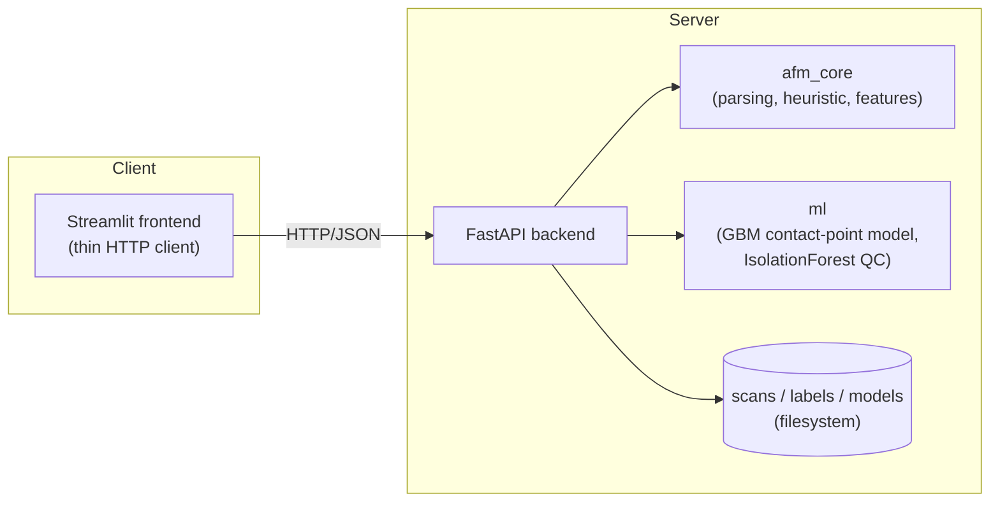

# AFM Explorer

A full-stack platform for analyzing Atomic Force Microscopy (AFM) force-distance
data: parses raw instrument exports, estimates the contact-point stiffness of
each force curve (via a classical heuristic *or* a trained ML model), and
serves interactive height/stiffness maps and a curve explorer through a
REST API + web frontend. Containerized with Docker Compose and deployable to
a free-tier cloud VM.

This started from four standalone analysis scripts (kept under
[`legacy_scripts/`](legacy_scripts) for reference) with copy-pasted parsing
logic and three different, inconsistent heuristics for the same
measurement. This project consolidates that into one tested library, adds a
supervised ML pipeline for the core estimation task, and wraps the whole
thing in a proper API/frontend/deployment story.

## Architecture



In production, nginx sits in front of both containers (`/` → frontend,
`/api` → backend) — see [`docker/nginx/nginx.conf`](docker/nginx/nginx.conf)
and [`docker-compose.prod.yml`](docker-compose.prod.yml).

## The AI feature

The core measurement this project makes — where does the AFM tip's
force-distance curve transition from noise to the linear "contact" region,
and what's the slope (stiffness) there — was previously three different
hand-tuned heuristics. This project adds a **supervised ML alternative**:

1. **Label**: click the true contact point on a real curve in the frontend's
   Label page (`POST /api/labels`).
2. **Expand**: each label is expanded into every sliding window over that
   curve (window=50, step=10, matching the classical heuristic), labeled
   positive/negative by whether it contains the true contact point — turning
   a handful of human labels into thousands of training rows
   ([`packages/ml/ml/dataset.py`](packages/ml/ml/dataset.py)).
3. **Train**: a `HistGradientBoostingClassifier` over engineered window
   features (slope, R², curvature, local variance, position, force
   stats — [`packages/afm_core/afm_core/features.py`](packages/afm_core/afm_core/features.py))
   is trained via `POST /api/train`, plus an unsupervised `IsolationForest`
   over whole-curve features for zero-label quality control.
4. **Evaluate**: [`packages/ml/ml/evaluate.py`](packages/ml/ml/evaluate.py)
   benchmarks the ML model against the classical heuristic on held-out
   labeled curves (curve-level split — no leakage), reporting mean
   contact-index error for both. This report is what the Model Training &
   Metrics page shows — the honest baseline-vs-ML comparison is the point,
   not just "we added ML."

Gradient boosting over engineered features (not a neural net) was a
deliberate choice: the realistic label budget for a project like this is
tens to a couple hundred hand-labeled curves, which is enough to train a
tree ensemble well but would overfit a deep model badly.

## Repo layout

```
packages/afm_core/   shared parsing + classical heuristic + feature engineering
packages/ml/         ML pipeline: dataset building, training, inference, evaluation
backend/             FastAPI app (REST API, storage, orchestration)
frontend/            Streamlit app (thin HTTP client)
docker/nginx/        reverse proxy config for prod
deploy/               EC2 bootstrap script
data/samples/        sample.txt fixture used by the test suite
legacy_scripts/      the four original scripts, kept for reference
```

## Running locally (no Docker)

```bash
python3 -m venv .venv && source .venv/bin/activate
pip install -e packages/afm_core -e packages/ml
pip install -r backend/requirements-dev.txt
pip install -r frontend/requirements.txt

# terminal 1
cd backend && uvicorn app.main:app --reload

# terminal 2
export BACKEND_URL=http://localhost:8000
cd frontend/streamlit_app && streamlit run Home.py
```

Then open http://localhost:8501, upload `data/samples/sample.txt`, and
explore. `data/samples/sample.txt` is a small demo scan (12 curves); label a
few curves' contact points on the Label page and train a model to see the
full pipeline (note: a real training run worth trusting needs labels on
dozens of curves from your full dataset, not the 6-push-curve sample).

## Running with Docker

```bash
docker compose up --build            # dev: hot-reload, ports 8000 + 8501 exposed directly
# or, production-shaped (nginx in front, no dev mounts):
docker compose -f docker-compose.yml -f docker-compose.prod.yml up -d --build
```

See [DEPLOY.md](DEPLOY.md) for taking this to a live, free-tier AWS EC2
instance with HTTPS and CI/CD.

## Testing

```bash
pytest packages/afm_core/tests   # parser + heuristic, using data/samples/sample.txt
pytest packages/ml/tests         # ML pipeline, using synthetic labeled curves
pytest backend/tests             # full API, via FastAPI TestClient
ruff check packages backend      # lint
```

`.github/workflows/ci.yml` runs all of the above (plus a Docker build check)
on every push/PR.

## API overview

Interactive docs are auto-generated at `/docs` when the backend is running
(FastAPI/Swagger). Key endpoints:

| Endpoint | Purpose |
|---|---|
| `POST /api/scans` | upload + parse a raw AFM `.txt` export |
| `GET /api/scans/{id}/heightmap` / `/stiffnessmap` | per-pixel maps (`method=heuristic\|ml`) |
| `GET /api/scans/{id}/curves/{s}/{i}/{j}/estimate` | contact-point fit for one curve |
| `POST /api/labels` | save a human-labeled contact point |
| `POST /api/train` → `GET /api/train/{job_id}` | train the ML model, poll status |
| `GET /api/models/active` | active model version + metrics |

## Known limitations / honest scope notes

- **Height map is an approximation.** The original project's topography
  came from a separate proprietary instrument-file channel that isn't part
  of this dataset. `ScanCache.height_map()` approximates it as the distance
  at each pixel's estimated contact point — documented in
  [`afm_core/preprocessing.py`](packages/afm_core/afm_core/preprocessing.py).
- **Storage is filesystem-based**, not a database — appropriate for a
  single-instance demo deployment; swapping in Postgres/S3 would be the
  natural next step for a multi-instance production version.
- **Training runs in-process via FastAPI `BackgroundTasks`**, not a task
  queue — reasonable because training takes seconds on this data/model
  scale; a real task queue (Celery/RQ) would be warranted at a larger scale.

## What this demonstrates (CV notes)

Full-stack scientific data platform (FastAPI + Streamlit + Docker) that
replaced three inconsistent, copy-pasted analysis scripts with a single
tested library. Supervised ML pipeline (gradient-boosted classifier over
engineered curve features) for contact-point detection, benchmarked against
a classical baseline, plus an unsupervised anomaly-detection layer.
Containerized two-service architecture with an nginx reverse proxy,
deployed to AWS EC2 with HTTPS via Cloudflare Tunnel, with GitHub Actions
CI/CD (automated tests + lint + Docker build check + SSH deploy).
